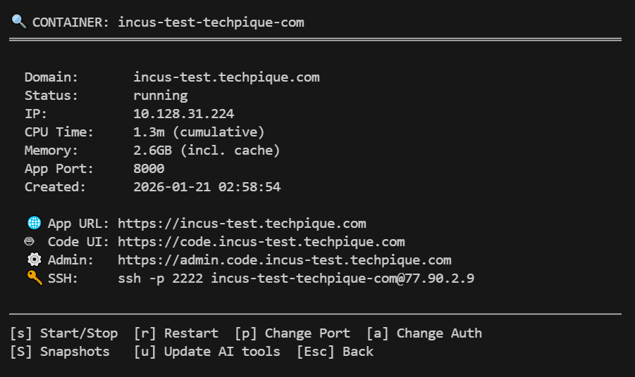
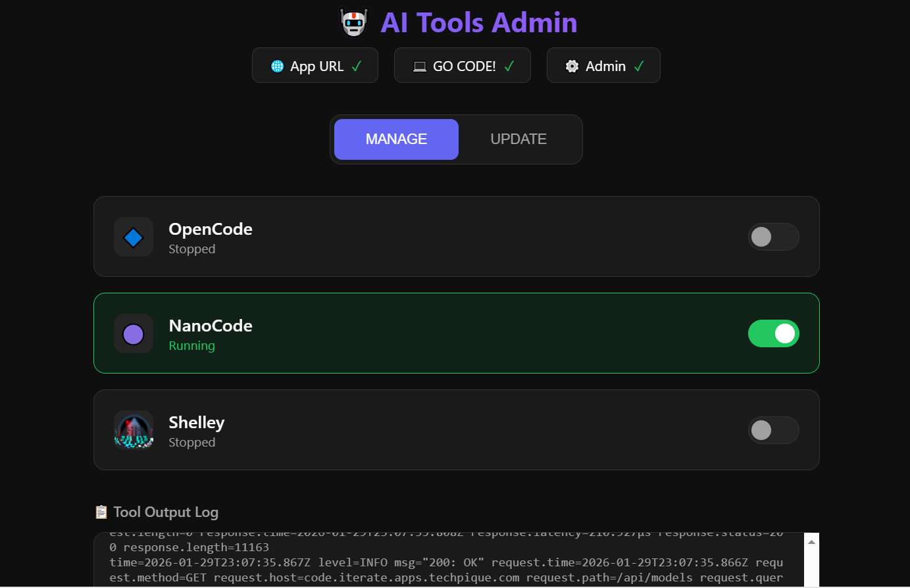
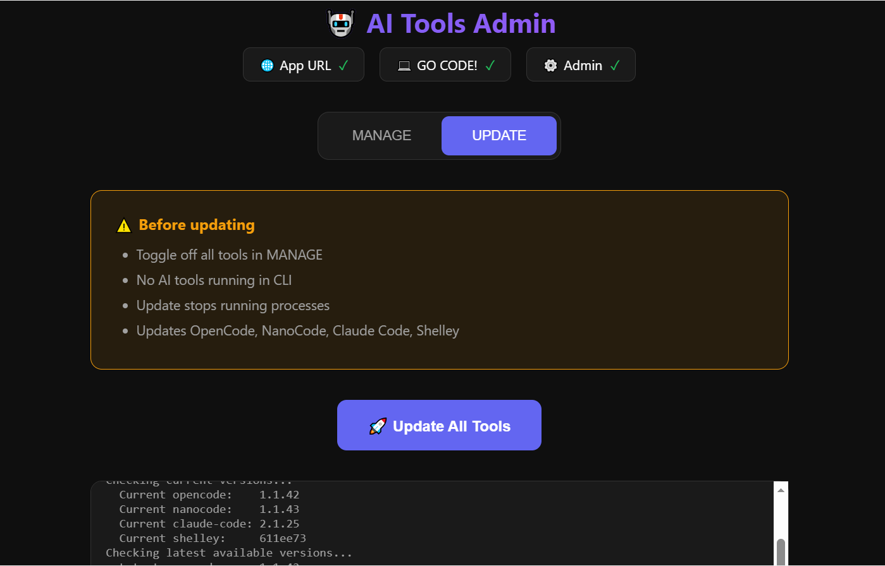

# vibebin

An Incus/LXC-based platform for self-hosting persistent AI coding agent sandboxes with Caddy reverse proxy and direct SSH routing to containers (suitable for VS Code remote ssh).

Create and host your vibe-coded apps on a single VPS/server.

## Screenshots

**Vibebin TUI Manager** - Container detail view with quick actions:



**AI Tools Admin Web App** - Toggle AI coding tools on/off:



**AI Tools Admin Web App** - One-click update for all tools:



## *UPFRONT DISCLOSURE*

This project is 99.9% vibe-coded on the [exe.dev](https://exe.dev/docs/list) platform using their Shelley Web AI Coding Agent and Claude Opus 4.5.
Take that as you will.

With that said, I am a huge proponent of the exe.dev platform, and if you can, you should definitely try it out and use their service. The love and care for that project/service is extremely evident... AND it is incredibly awesome (and I think it's in its infancy stages, so should only get better).

## *WARNING*

This is a very new project. Feel free to test and experiment but it's likely to have bugs and may not be ready for production. Use at your own risk.

## What is this?

This project provides the infrastructure to self-host your own AI coding environment on virtually any Linux server -- a VPS, cloud VM (EC2, GCP, Azure), or dedicated hardware. Because it uses **Incus/LXC** (container-based virtualization rather than nested VMs), it runs efficiently on KVM, VMware, Xen, Hyper-V, and most other hypervisors.

Each container is a fully persistent Linux sandbox running **Ubuntu 24.04 LTS (Noble)** or **Debian 13 (Trixie)**, with:

- **[opencode](https://github.com/anomalyco/opencode)**, **[nanocode](https://github.com/nanogpt-community/nanocode)**, and **[Shelley](https://github.com/boldsoftware/shelley)** - AI coding agents with terminal and web UI interfaces
- **AI coding web UI** accessible via HTTPS at `code.yourdomain.com` (Basic Auth protected)
- **AI Tools Admin** web app at `admin.code.yourdomain.com` for managing AI coding tools
- **Your app/site** accessible via HTTPS at `yourdomain.com`
- **SSH access** for direct terminal access to your sandbox (VS Code Remote SSH compatible)
- **Persistent filesystem** that survives container restarts
- **Pre-installed development tools**: Docker, Go, Node.js, Bun, Deno, uv

### Use Cases

- **AI-assisted development**: Use opencode/nanocode/shelley as your AI pair programmer with full system access
- **Vibe coding**: Spin up isolated sandboxes for experimental projects
- **App/site hosting**: Deploy and iterate on web applications
- **Learning environments**: Safe, isolated Linux environments for experimentation
- **CI/CD sandboxes**: Temporary or persistent build environments

### Stack Overview

| Component | Purpose |
|-----------|--------|
| **Incus (LXC)** | Container runtime - lightweight, persistent Linux containers |
| **Caddy** | Reverse proxy with automatic HTTPS (Let's Encrypt) |
| **SSHPiper** | SSH routing - access any container via `ssh -p 2222 container-name@host` |
| **SQLite** | Local database for container metadata (`/var/lib/vibebin/containers.db`) |
| **Ubuntu/Debian** | Native Incus images (user choice during creation) |
| **opencode** | Open source AI coding agent with terminal and web UI |
| **nanocode** | NanoGPT-powered AI coding agent (fork of opencode) |
| **shelley** | AI coding web agent from Bold Software |

### AI Coding Agents

This project installs **opencode**, **nanocode**, and **shelley** in each container:

#### opencode

[OpenCode](https://github.com/anomalyco/opencode) is a 100% open source AI coding agent that works with multiple LLM providers:
- Anthropic (Claude)
- OpenAI (GPT)
- Google (Gemini)
- OpenCode Zen
- Local models via custom endpoints

#### nanocode

[NanoCode](https://github.com/nanogpt-community/nanocode) is a fork of OpenCode configured to work with [NanoGPT](https://nano-gpt.com/subscription/hGfwRWc9) as the default provider. It includes:
- Automatic model loading from NanoGPT API
- Built-in NanoGPT MCP server
- Interleaved thinking for reasoning models

[NanoGPT subscription](https://nano-gpt.com/subscription/hGfwRWc9) is $8/month for 60,000 requests across all open models - an excellent value that works great with NanoCode.

**Note:** The nanocode web UI requires LLM configuration before it will work. SSH into the container and run `nanocode` (CLI mode) first to configure your LLM provider/API keys.

> *Disclosure: The NanoGPT link is an affiliate link.*

#### shelley

[Shelley](https://github.com/boldsoftware/shelley) is a powerful AI web agent from Bold Software:
- Web-based UI only (no CLI mode)
- Support for multiple LLM providers via environment variables (Anthropic, OpenAI, Gemini, Fireworks)
- Custom model configuration available within the web UI
- Runs on port 9999 like the other AI tools

**Note:** Before starting Shelley, add your API keys to `~/.shelley_env`. Custom models can be configured in Shelley's web UI, but doing so switches to "custom model mode" and the env var models will no longer be shown.

All tools support terminal and web UI modes. Configure your LLM credentials on first run.

## Components

- `vibebin` - Interactive TUI for container management
- `vibebin_sync_daemon` - Background service for config synchronization
- `containers.db` - SQLite database storing container metadata (at `/var/lib/vibebin/containers.db`)

## Prerequisites

- **Fresh/minimal Linux installation**: Ubuntu 22.04+ or Debian 12+ (amd64 or arm64)
- **VPS or VM**: Works on most virtualization platforms (KVM, VMware, Xen, EC2, GCP, Azure, etc.)
- **Memory**: Minimum 4GB RAM; 8GB+ recommended for best performance
- **Go 1.21+**: Required to build the tools (see Quick Start for installation)
- **A domain name** with DNS you control
- **A regular user with sudo access** (avoid running as root)

### Recommended VPS Providers

Any KVM-based VPS will work well with vibebin. Here are some recommended options:

**HostBRR** - Budget-friendly with excellent performance:
- [HostBRR Epyc Turin VPS](https://my.hostbrr.com/order/main/packages/BF2025/?group_id=74&a=MTA4OTY=) - AMD Epyc Turin processors, great price/performance
- [HostBRR Threadripper Performance VPS](https://my.hostbrr.com/order/main/packages/BF2025/?group_id=72&a=MTA4OTY=) - High-performance Threadripper line

**Netcup** - German provider with reliable infrastructure:
- [Netcup VPS](https://www.netcup.com/en/?ref=75646) - Recommend RS1000 (8GB RAM) or RS2000 (16GB RAM) for vibebin workloads

**OVHcloud** - Large European provider with competitive pricing:
- [OVHcloud VPS](https://www.ovhcloud.com/en/vps/vps-8gb/) - Recommend 8GB or 12GB VPS; larger options (24GB, 48GB) available at excellent prices if needed

**Oracle Cloud Infrastructure (OCI)** - Free tier available:
- [OCI Always Free Resources](https://docs.oracle.com/en-us/iaas/Content/FreeTier/freetier_topic-Always_Free_Resources.htm) - Includes free ARM-based VMs (up to 4 OCPUs, 24GB RAM) that work well with vibebin

> *Disclosure: The HostBRR and Netcup links above are affiliate links.*

### Security Recommendations

Before installing, ensure your host SSH is properly secured:

```bash
# In /etc/ssh/sshd_config, verify these settings:
PermitRootLogin no
PasswordAuthentication no
```

All administrative tasks should be performed as a regular user with `sudo` privileges, not as root directly.

## Quick Start

### 1. Install Go (if not already installed)

```bash
# Install wget, curl & git
sudo apt update && sudo apt install wget curl git

# Ubuntu/Debian - install from official Go downloads
wget https://go.dev/dl/go1.23.5.linux-amd64.tar.gz
sudo rm -rf /usr/local/go && sudo tar -C /usr/local -xzf go1.23.5.linux-amd64.tar.gz
echo 'export PATH=$PATH:/usr/local/go/bin' >> ~/.bashrc
source ~/.bashrc

# Verify installation
go version
```

> **Note**: For ARM64 systems, use `go1.23.5.linux-arm64.tar.gz` instead.
> Check https://go.dev/dl/ for the latest version.

### 2. Install vibebin (Recommended)

Use the install script for a one-liner install or upgrade:

```bash
curl -fsSL https://raw.githubusercontent.com/jgbrwn/vibebin/main/install-upgrade.sh | bash
```

The script automatically:
- Clones and builds the project
- Installs binaries to `/usr/local/bin/`
- Detects fresh install vs upgrade
- Handles the `vibebin-sync` service accordingly

### Alternative: Build from Source

If you prefer to build manually:

```bash
# Clone and build
git clone https://github.com/jgbrwn/vibebin.git
cd vibebin
go build -o vibebin vibebin.go
go build -o vibebin_sync_daemon vibebin_sync_daemon.go

# Install binaries
sudo cp vibebin vibebin_sync_daemon /usr/local/bin/
```

### 3. Run First-Time Setup

```bash
# This auto-installs Incus, Caddy, and SSHPiper
sudo vibebin
```

### 4. Configure SSH (Required)

See the [SSHPiper Manual Setup](#%EF%B8%8F-required-sshpiper-manual-setup-after-first-run) section below.

### 5. Create Your First Container

```bash
sudo vibebin
```

The creation wizard will guide you through:
1. Enter domain name
2. Select base image (Ubuntu or Debian)
3. Configure DNS (optional auto-creation via Cloudflare/deSEC)
4. Set app port
5. Provide SSH public key
6. Set basic auth credentials for web UI protection

### Auto-installed Dependencies

The first run automatically installs:
- **Incus 6.20+** from Zabbly stable repository
- **Caddy** web server with automatic HTTPS
- **SSHPiper** SSH routing proxy

### What Gets Installed in Each Container

During container creation, the following is automatically installed:

**Development Tools:**
- **Docker** (via official get.docker.com script)
- **Go** (latest version, architecture auto-detected)
- **Node.js** (latest LTS via NodeSource)
- **Bun** (JavaScript runtime and package manager)
- **Deno** (JavaScript/TypeScript runtime)
- **uv** (Python package manager from Astral)
- **GitHub CLI** (`gh`) for GitHub operations
- **Build tools** (build-essential, make, etc.)

**AI Coding Agents:**
- **opencode** (open source AI coding agent)
- **nanocode** (NanoGPT-powered AI coding agent)
- **shelley** (AI web agent from Bold Software)

**System Utilities:**
- **Editors**: neovim, mc (Midnight Commander)
- **Terminal multiplexers**: screen, tmux, byobu
- **Monitoring**: htop, atop, btop, iotop, ncdu
- **Networking**: dnsutils, net-tools, socat, lftp, ncftp
- **Search**: ripgrep, sqlite3
- **Media**: imagemagick, ffmpeg
- **Fonts**: emoji support (fonts-noto-color-emoji, fonts-symbola)
- And many more development and debugging utilities

**Configuration:**
- **Project directory** (`~/projects` for AI coding tool workspaces)
- **Custom MOTD** (shows container info, URLs, and tool versions on SSH login)
- **Passwordless sudo** for the container user
- **Ping without sudo** (CAP_NET_RAW capability)

## ⚠️ Required: SSHPiper Manual Setup (After First Run)

**Before creating containers**, verify SSHPiper is running:

```bash
# Check SSHPiper status (should be active)
sudo systemctl status sshpiperd

# If not running, start it
sudo systemctl enable --now sshpiperd
```

SSHPiper listens on **port 2222** for container SSH access. Host SSH remains on port 22.

### Verify Security Settings

Ensure your host SSH is properly secured in `/etc/ssh/sshd_config`:

```bash
PermitRootLogin no
PasswordAuthentication no
```

## Usage

```bash
sudo vibebin
```

### Key Bindings

**List View:**
- `n` - Create new container
- `Enter` - View container details
- `d` - Delete container
- `u` - Show untracked containers (import existing)
- `D` - Manage DNS API tokens (Cloudflare/deSEC)
- `i` - View Incus logs
- `l` - View sync daemon logs
- `q` - Quit

**Detail View:**
- `s` - Start/Stop container
- `r` - Restart container
- `p` - Change app port
- `a` - Change auth credentials
- `S` - Snapshot management
- `u` - Update AI coding tools (opencode/nanocode/shelley)
- `Esc` - Back to list

**Snapshot View:**
- `n` - Create new snapshot
- `Enter/r` - Restore selected snapshot
- `d` - Delete selected snapshot
- `↑/↓` or `j/k` - Navigate snapshots
- `Esc` - Back to container details

## Features

### Container Management
- **Native Incus Images**: Choose Ubuntu 24.04 LTS or Debian 13
- **Persistent Sandboxes**: Full filesystem persistence across restarts
- **Boot Behavior**: Containers respect their last state on host reboot
- **Resource Monitoring**: Live CPU and memory usage in TUI
- **Untracked Import**: Detect and adopt existing Incus containers
- **Snapshots**: Create, restore, and delete container snapshots

### Networking & Access
- **Automatic HTTPS**: Caddy handles Let's Encrypt certificates
- **Reverse Proxy**: Each container gets `https://domain.com` → Container's app (port 8000, configurable)
- **SSH Routing**: SSHPiper on port 2222 enables `ssh -p 2222 container-name@host` access
- **Auto DNS**: Cloudflare and deSEC API integration (tokens saved securely for reuse)

### AI Coding Agents
- **opencode**: Open source, supports multiple LLM providers
- **nanocode**: NanoGPT-optimized fork with built-in features
- **shelley**: AI web agent with full coding capabilities
- **Easy Configuration**: All tools prompt for API keys on first run
- **Web UI Access**: Start any tool in serve mode on port 9999

## Using the AI Coding Tools

After creating a container, SSH in and run any of the tools. A project directory is pre-created at `~/projects` for your coding workspaces.

### Terminal Mode

```bash
# SSH to your container
ssh -p 2222 container-name@host.example.com

# cd to projects directory first
cd ~/projects

# Run opencode
opencode

# Or run nanocode
nanocode

```

All tools will prompt you to configure your LLM provider and API key on first run. Note that Shelley is web-only (no CLI mode).

### Web UI Mode

To access the AI coding agent via web browser:

```bash
# SSH to your container
ssh -p 2222 container-name@host.example.com
```

**opencode** (cd to project directory first):
```bash
cd ~/projects
screen -S code
opencode serve --port 9999 --hostname 0.0.0.0
```

**nanocode** (cd to project directory first):
```bash
cd ~/projects
screen -S code
nanocode serve --port 9999 --hostname 0.0.0.0
```

> **Note:** nanocode web UI requires LLM configuration first. Run `nanocode` (CLI) to configure your provider/API keys before starting the web UI.

**shelley** (web UI only - no CLI mode):
```bash
cd ~/projects
screen -S code
start-shelley.sh 2>&1 | tee -a ~/.shelley.log
```

> **Note:** Before starting Shelley, add your API keys to `~/.shelley_env`. Custom models can be configured in Shelley's web UI, but doing so switches to "custom model mode" and the env var models will no longer be shown.

Then access via `https://code.yourdomain.com` (protected by Basic Auth credentials you set during container creation).

Press `Ctrl+A, D` to detach from screen. Reattach with `screen -x code`.

> **Note**: Only one web UI can run on port 9999 at a time. Stop the current one before starting another.


### AI Tools Admin Web App

Each container includes an **AI Tools Admin** web app accessible at `https://admin.code.yourdomain.com`. This provides:

**MANAGE View:**
- Toggle AI coding tools (OpenCode, NanoCode, Shelley) on/off
- Only one tool can run at a time on port 9999
- View real-time output logs
- Links to App URL and Code UI
- DNS health check indicators

**UPDATE View:**
- One-click update for all three AI tools
- Automatically stops running processes before updating
- Shows live progress of updates

The admin app runs as a systemd service (`admin-app`) and is protected by the same Basic Auth credentials as the Code UI.

> **Note**: For Shelley, ensure your API keys are configured in `~/.shelley_env` before starting.

### Updating AI Tools

From the container detail view in the TUI, press `u` to update opencode, nanocode, and shelley to their latest versions.

## SSH Access

### To containers (via SSHPiper on port 2222):
```bash
ssh -p 2222 container-name@host.example.com
# You'll be logged in as 'ubuntu' (or 'debian') with sudo access
```

### To host (standard SSH on port 22):
```bash
ssh user@host.example.com
```

## DNS Configuration

For HTTPS to work, DNS must point to the host server:
- `domain.com` → Host IP
- `code.domain.com` → Host IP (for AI coding web UI)
- `admin.code.domain.com` → Host IP (for AI tools admin app)

Caddy will automatically obtain Let's Encrypt certificates for both domains.

## Architecture

```
                              Internet
                                 │
                    ┌────────────┴────────────┐
                    │                         │
                    ▼                         ▼
              HTTPS (:443)         SSH (:2222 via SSHPiper)
                    │                         │
┌───────────────────▼─────────────────────▼─────────────────┐
│                         Host System                          │
├─────────────────────────────────────────────────────────────┤
│                                                               │
│  ┌─────────────┐           ┌─────────────┐                    │
│  │    Caddy    │           │  SSHPiper   │                    │
│  │  (reverse   │           │  (SSH       │                    │
│  │   proxy)    │           │   router)   │                    │
│  └──────┬──────┘           └──────┬──────┘                    │
│         │                         │                           │
│         │    Routes by domain     │    Routes by username     │
│         ▼                         ▼                           │
│  ┌─────────────────────────────────────────────────────┐     │
│  │                    Incus (LXC)                       │     │
│  │                                                      │     │
│  │  ┌─────────────────┐  ┌─────────────────┐              │     │
│  │  │ Container      │  │ Container      │    ...       │     │
│  │  │ (Ubuntu/Debian)│  │ (Ubuntu/Debian)│              │     │
│  │  │                │  │                │              │     │
│  │  │  ┌───────────┐ │  │  ┌───────────┐ │              │     │
│  │  │  │ AI Coding │ │  │  │ AI Coding │ │              │     │
│  │  │  │ Tool UI   │ │  │  │ Tool UI   │ │              │     │
│  │  │  │  (:9999)  │ │  │  │  (:9999)  │ │              │     │
│  │  │  └───────────┘ │  │  └───────────┘ │              │     │
│  │  │  ┌───────────┐ │  │  ┌───────────┐ │              │     │
│  │  │  │admin.code │ │  │  │admin.code │ │              │     │
│  │  │  │  (:8099)  │ │  │  │  (:8099)  │ │              │     │
│  │  │  └───────────┘ │  │  └───────────┘ │              │     │
│  │  │  ┌───────────┐ │  │  ┌───────────┐ │              │     │
│  │  │  │ Your App  │ │  │  │ Your App  │ │              │     │
│  │  │  │  (:8000)  │ │  │  │  (:8000)  │ │              │     │
│  │  │  └───────────┘ │  │  └───────────┘ │              │     │
│  │  └─────────────────┘  └─────────────────┘              │     │
│  └─────────────────────────────────────────────────────┘     │
│                                                               │
│  ┌───────────────────┐                                        │
│  │  vibebin        │  TUI for container management            │
│  │  (this tool)     │  - Create/delete containers              │
│  │                  │  - Configure domains & auth              │
│  └───────────────────┘                                         │
│                                                               │
└─────────────────────────────────────────────────────────────┘
```

### How Traffic Flows

1. **HTTPS requests** to `myapp.example.com` → Caddy → Container's app (port 8000)
2. **HTTPS requests** to `code.myapp.example.com` → Caddy (with Basic Auth) → AI coding web UI (port 9999)
3. **SSH connections** to port 2222 as `myapp-example-com@host` → SSHPiper → Container's SSH as `ubuntu`/`debian`

### Caddy Configuration

Routes are managed via Caddy's Admin API (localhost:2019), not config files:
- Routes use `@id` for identification (e.g., `container-name-app`, `container-name-code`)
- Changes are atomic and immediate (no reload required)
- Query current routes: `curl http://localhost:2019/config/apps/http/servers/srv0/routes`

### Container Boot Behavior

Containers use Incus's default "last-state" behavior (by not setting `boot.autostart`):

- Running containers will restart when the host reboots
- Stopped containers will stay stopped

Incus automatically tracks each container's power state and restores it when the daemon starts.

## Snapshots

Snapshots allow you to save and restore the complete state of a container.

### Creating Snapshots

From the container detail view, press `S` to access snapshot management, then `n` to create.

### Use Cases

- **Before risky changes**: Snapshot before major updates or experiments
- **Known-good states**: Save working configurations you can restore to
- **Quick rollback**: Instantly revert if something breaks

> **Note**: Snapshots are stored by Incus and consume disk space. Delete old snapshots to free space.

## Troubleshooting

**Container won't start:**
```bash
journalctl -u incus -f
incus info container-name
```

**Caddy certificate errors:**
- Ensure DNS is configured and pointing to host IP before creating container
- Check Caddy logs: `journalctl -u caddy -f`
- Check current routes: `curl -s http://localhost:2019/config/apps/http/servers/srv0/routes | jq .`

**SSH to containers not working:**
- Verify SSHPiper is running: `systemctl status sshpiperd`
- Ensure you're using port 2222: `ssh -p 2222 container-name@host`
- Verify upstream config: `cat /var/lib/sshpiper/container-name/sshpiper_upstream`

**AI coding tools not working:**
- SSH to the container and run `opencode` or `nanocode` interactively, or `start-shelley.sh` for Shelley web UI
- All tools will prompt for API key configuration on first run
- Check tool versions: `opencode --version`, `nanocode --version`, `shelley version`

**Sync daemon issues:**
```bash
journalctl -u vibebin-sync -f
```

## Subdomain Support

You can use subdomains for your containers:
- `app.example.com` - works correctly
- `staging.app.example.com` - works correctly
- `my-app.example.com` - works correctly

### Limitation: Two-Part TLDs

Domains with two-part TLDs (like `.co.uk`, `.com.au`) are **not fully supported** 
for automatic DNS creation. The zone detection assumes a single-part TLD.

For example:
- ✅ `app.example.com` → zone: `example.com` (correct)
- ❌ `app.example.co.uk` → zone: `co.uk` (incorrect, should be `example.co.uk`)

**Workaround**: For two-part TLDs, select "No" for auto DNS creation and 
configure DNS records manually.

## Security & Isolation

Each container created by vibebin is fully isolated by default:

### Filesystem Isolation
- Each container has its own complete, persistent filesystem (Ubuntu 24.04 or Debian 13)
- Containers cannot access each other's filesystems
- Uses Incus/LXC which provides OS-level virtualization with separate root filesystems
- Data persists across container restarts

### Network Isolation
- Each container gets its own private IP on an internal bridge network (typically `10.x.x.x`)
- Containers can communicate with each other by default as they are on the same bridge network on the host
- All external access is routed through:
  - **Caddy** (HTTPS reverse proxy) for web traffic
  - **SSHPiper** (port 2222) for SSH access
- Each container only exposes what's explicitly configured (by default this is: app port/8000 (configurable), code UI port/9999, admin.code/8099)

### Process Isolation
- Containers use Linux namespaces (PID, network, mount, user, etc.)
- Processes in one container cannot see or interact with processes in another
- Each container has its own init system and process tree

### Security Note

`security.nesting=true` is enabled to allow Docker-in-container (useful for development). This is standard for development environments but worth noting for security-sensitive deployments.

### In Practice

If you run 3 containers (app1.example.com, app2.example.com, app3.example.com):
- Each has its own isolated Linux environment
- Each has its own AI tools installation (opencode, nanocode, shelley)
- An agent in app1 cannot access files or processes in app2 or app3
- They share the host's resources (CPU, RAM) but are otherwise independent

It's essentially like having separate lightweight VMs, but with much lower overhead than full virtualization.

## Roadmap

### Storage Driver Selection

Currently, this implementation uses the **Incus DIR storage driver** for proof of concept. The DIR driver uses basic filesystem-level storage and is:
- Simple to set up (no additional dependencies)
- Compatible with any filesystem
- **Slow for snapshots** (full copy-on-write not available)

**Planned**: During the dependencies/installation phase, users will be able to choose between:

| Driver | Pros | Cons |
|--------|------|------|
| **DIR** | Simple, works everywhere | Slow snapshots, no CoW |
| **Btrfs** | Fast snapshots, CoW, compression | Requires Btrfs filesystem |
| **ZFS** | Fast snapshots, CoW, excellent features | Requires significant RAM (1GB+ per TB of storage) |

Btrfs and ZFS provide instant snapshots via copy-on-write, making them much more suitable for production use.

## License

This project is licensed under the MIT License. See [LICENSE](LICENSE) for details.

### Third-Party Components

- **opencode**: [anomalyco/opencode](https://github.com/anomalyco/opencode) - MIT License
- **nanocode**: [nanogpt-community/nanocode](https://github.com/nanogpt-community/nanocode) - Fork of opencode
- **shelley**: [boldsoftware/shelley](https://github.com/boldsoftware/shelley) - Apache License 2.0
- **Incus**: [linuxcontainers/incus](https://github.com/lxc/incus) - Apache 2.0 License
- **Caddy**: [caddyserver/caddy](https://github.com/caddyserver/caddy) - Apache 2.0 License
- **SSHPiper**: [tg123/sshpiper](https://github.com/tg123/sshpiper) - MIT License
